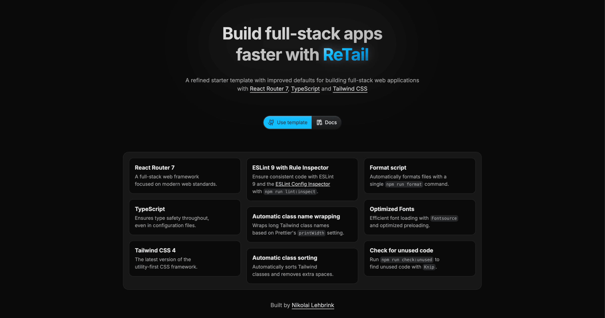

<a href="https://retail.nikolailehbr.ink/">
  
  <h1 align="center">ReTail</h1>
</a>

<p align="center">
A refined React Router starter template with improved defaults for building full-stack web applications.
</p>

<p align="center">
  <a href="#why"><strong>Why</strong></a> ·
  <a href="#features"><strong>Features</strong></a> ·
  <a href="#development"><strong>Development</strong></a> ·
  <a href="#deployment"><strong>Deployment</strong></a>
</p>
<br/>

## Why

When I first started using `Remix`, the predecessor to `React Router 7`, I worked with the [official `Remix` template with `Vite`](https://github.com/remix-run/remix/tree/main/templates/remix). However, it lacked built-in support for `Tailwind CSS`, requiring me to manually install and configure it for every new project. To simplify this setup, I created my own starter template: **ReTail** (`Remix`/`React Router` + `Tailwind CSS`).

Since then, the official `Remix` template has added `Tailwind CSS` support, and `React Router 7` has been released. Despite these updates, I continue to maintain ReTail because I think it provides better defaults, includes `ESLint 9`, and integrates useful utilities that improve the development experience with `Tailwind CSS` and other tools.

## Features

- **React Router 7** – The latest version of React Router, paired with Vite for instant server start, fast HMR, and optimized full-stack builds.
- **Tailwind CSS 4** – Build UIs faster with the utility-first CSS framework and its new CSS-first configuration.
- **Vite 6** – A lightning-fast frontend build tool that delivers instant code serving and optimized bundling.
- **Automatic class name wrapping** – Keeps long class names readable using [`prettier-plugin-classnames`](https://www.npmjs.com/package/prettier-plugin-classnames).
- **Automatic class sorting** – Ensures consistent class order with [`prettier-plugin-tailwindcss`](https://tailwindcss.com/blog/automatic-class-sorting-with-prettier).
- **Font optimization** – Preloads local fonts efficiently with [Fontsource](https://fontsource.org/).
- **ESLint 9** – Maintains code quality with ESLint and the [ESLint Config Inspector](https://eslint.org/blog/2024/04/eslint-config-inspector/).

## Helpful Scripts

> [!TIP]
> Use any package manager you prefer, such as `npm` or `yarn`, instead of `pnpm`.

- **`pnpm format`**: Format all your files with Prettier.
- **`pnpm lint`**: Lint your code with ESLint.
- **`pnpm lint:inspect`**: Inspect your ESLint configuration with the ESLint Config Inspector.
- **`pnpm start`**: Run the app locally in production mode.
- **`pnpm typecheck`**: Generate TypeScript types for your app.
- **`pnpm clean`**: Remove the `node_modules` directory.

## Development

> [!TIP]
> Use any package manager you prefer, such as `npm` or `yarn`, instead of `pnpm`.

Run the Vite dev server:

```shellscript
pnpm dev
```

This will automatically open the app in your default browser and expose the host IP to your network, enabling better testing on devices like smartphones.

## Deployment

> [!TIP]
> Use any package manager you prefer, such as `npm` or `yarn`, instead of `pnpm`.

First, build your app for production:

```sh
pnpm build
```

Then run the app in production mode:

```sh
pnpm start
```

Now you'll need to pick a host to deploy it to.
